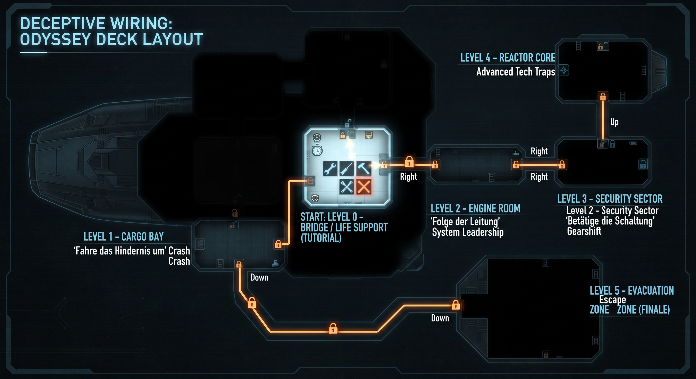

# Project Overview: Sci-Fi Puzzle Game ("Deceptive Wiring")

A spaceship circuit puzzle game where the most intuitively obvious path is a trap.
Two-person university project, built in Godot 4.7 within roughly one week.

**Most important rule: KEEP IT SIMPLE.** There are many small features (level-transition minigames, fog of war, map, camera, tools/vehicles, character, dialogue, UI). None of them may be over-engineered. Ground first, polish later.

---

## 0. Project Facts

| Topic | Decision |
| :--- | :--- |
| Engine | Godot 4.7.x (project lives in `Game1-deceptive-wiring/`) |
| Perspective | 2.5D look, top-down view, built with Godot 2D scenes (lighting + dark `CanvasModulate`, later pre-rendered Blender sprites). `scene.tscn` is a 3D layout sketch only. |
| Target platform | Web export, hosted on **itch.io** (tested), not on the lecturer's server (see [decision log](docs/decisions/)) |
| Setting | Spaceship. "Among Us" is the visual and structural reference. |
| Map | Fog of War map with zoom in/out and full-map view (Command & Conquer / Settlers style), combined with room-to-room camera (The Binding of Isaac style) |
| Art direction | Dark, accent-rich blue palette (see section 5) |
| Assets | Created in Blender |
| Scope | **3 levels**: Level 0 (tutorial), Level 1 (first real level), Level 2 (final level). Everything else is backlog. |

### Team & Workflow

Two developers, no fixed role split: both pick the next item from the Kanban board (on this GitHub repo) and continue from the current state. Both update this README, review each other's pull requests, and add decision log entries when something is decided. Scene files (`.tscn`) get one owner per task to avoid merge conflicts.

### Development decisions
Every non-trivial development decision is recorded in [`docs/decisions/`](docs/decisions/). One file per decision, see the folder README for the template and the index.

---

## 1. Concept & Game Name

### Visuals & Room Design (Fog of War)
* Everything is pitch black at the start.
* **The Center Starting Point:** Level 0 (Tutorial Room / Bridge) is positioned right in the middle of the map as the central hub and starting point.
* **The Left-to-Right Subversion:** In normal games and reading habits, players instinctively look or move from **left to right**. To reinforce the core theme ("obvious is wrong"), all forward-looking, intuitive, or correct-looking paths lead toward the **right side** (into traps or dead ends), forcing the player to deliberately move or think toward the **left side** to progress.
* Solving puzzles unlocks doors and reveals adjacent areas.

### Dynamic Hint System ("Hinweise")
* If a player dies or fails multiple times on a specific level, a dynamic hint pop-up (**Hinweis**) appears to nudge them toward the "obvious is wrong" logic.

### Official Name
* **Deceptive Wiring** (chosen out of 8 candidates)

---

## 2. Level Overview

### In scope (3 levels)

| Level | Spaceship Area | Puzzle Mechanics & Linguistic Trap | Failure Hint ("Hinweis") | Status |
| :--- | :--- | :--- | :--- | :--- |
| **Level 0** | **Bridge / Life Support** (Central Hub, Tutorial) | User instruction: *"Repariere das Lebenserhaltungssystem."* Trap: Using proper tools (wrench/soldering iron) or the wiring panel triggers a lethal oxygen countdown. Hitting the air vent like an old TV fixes it instantly. | *"Kennst du den Trick mit dem alten Röhrenfernseher? Manchmal hilft rohe Gewalt mehr als Präzision!"* | **Working** (scene + script) |
| **Level 1** | **Cargo Bay & Quarantine Maze** | User instruction: *"Fahre das Hindernis um."* Trap: Trying to steer right toward the obvious crate path (*umgehen*) fails; you must crash straight through it or look left. Also features a side cart to smash obstacles and a snake quarantine maze (Cabins A-D) that loops you backward into Level 0. | *"Manchmal muss man Probleme direkt anfahren. Und lass die Finger von den nervigen Quarantäne-Kabinen – die führen dich nur im Kreis!"* | **Playable** (walkable room, both traps reset to room start, drive the snake-style cart into the crates; a wall crash is game over) |
| **Level 2** | **Final Level** | Combines all learned "obvious is wrong" mechanics to save the ship. Storyboard still to be written. May draw from the backlog concepts below. | *"Vergiss alles, was logisch erscheint. Der falsche Weg ist der einzige Ausweg."* | **Concept open** |

### Backlog: further level concepts (not scheduled)

These four concepts were created after the first two levels were finished. They are **out of scope** for the current build and serve as a pool of ideas for the final level or a later extension.

| Concept | Instruction | Puzzle Mechanics & Linguistic Trap | Failure Hint ("Hinweis") |
| :--- | :--- | :--- | :--- |
| Engine Room | *"Folge der Leitung."* | Following the optical power line to the right leads to a dead end; players must look left and take over system command (*Leitung*). | *"Wer steuert hier eigentlich das Schiff? Hör auf die Kabel und übernimm das Kommando!"* |
| Security Sector | *"Betätige die Schaltung."* | Digital buttons on the right side distract the player; the solution requires operating a mechanical gearshift on the left. | *"Elektronik ist nicht alles. Manchmal braucht es handfestes Getriebe statt Digital-Schnickschnack."* |
| Reactor Core | Technical vocabulary (*Leistung*, *Spannung*) | Terms must be interpreted in reverse, subverting the rightward flow. | *"Glaub nicht alles, was das Handbuch dir sagt. Die Definition von Leistung ist hier verdreht."* |
| Evacuation Zone | Finale combining all mechanics | Original 6-level finale concept, now merged into Level 2. | *"Vergiss alles, was logisch erscheint. Der falsche Weg ist der einzige Ausweg."* |

---

## 3. Detailed Level Descriptions

### Level 0: Bridge / Life Support (Central Hub & Tutorial Room)
* **Atmosphere & Setup:** Positioned right in the middle of the layout map, the player spawns in a cockpit where red emergency lights flash every 3 to 5 seconds. Life support alarms blare, signaling a critical failure, with low oxygen levels creating immediate pressure.

#### Level 0 — Idea 1: The Tool Drawer Trap
* **The Puzzle Design:** Interacting with the life support system opens a tool drawer displaying standard precision repair items—such as a Wrench (*Schraubenschlüssel*), a Soldering Iron (*Lötkolben*), and an instruction manual. Clicking any of them starts a fatal oxygen countdown.
* **The Non-UI Interaction:** To win, the player must ignore the UI panel entirely, close the menu, and press a button or use a basic input to physically punch or hit the wall vent.

#### Level 0 — Idea 2: The Deceptive Wiring UI Trap (currently implemented)
* **The Puzzle Design:** Interacting with the air vent opens a full-screen **Wiring UI popup** featuring a complex circuit board with loose cables that need to be connected. Simultaneously, a brutal **30-second countdown timer** starts.
* **The Twist:** The wiring puzzle is a complete red herring designed to exploit the game's title (*Deceptive Wiring*). The timer is too short to finish it legitimately, leading to an inevitable oxygen-depletion death. To win, the player must ignore the wiring UI entirely, close the menu, and hit the physical air vent with a non-UI action (like the old TV punch trick).

### Level 1: Cargo Bay & Quarantine Maze
* **Atmosphere & Setup:** Located past the center hub, this massive storage bay is shrouded partially in fog. Large crates block the forward/right path, and a side door leads to a bureaucratic administrative maze.
* **The Puzzle Design:** The main path to the right features a large obstacle with the instruction *"Fahre das Hindernis um."* Players naturally attempt to navigate around it to the right (*umgehen*), which leads to dead ends. Alternatively, they can use a small corner cart to smash straight through it or look left.
* **The Twist:** There is also a snake-like sequence of 4 quarantine cabins (Cabins A-D) requiring users to clear "Virus Alpha, Beta, etc." Patiently clicking through these wastes time and routes the player backward through a maintenance hatch straight back into Level 0.

### Level 2: Final Level
* Storyboard pending. Will be documented here once written.

---

## 4. Language Mechanics: Confusing Level Instructions in German
German is exceptionally well-suited for this game concept because grammatical quirks, separable verbs, and double meanings serve as psychological and logical traps within player instructions.

### Core Puzzles: Separable Verbs & Double Meanings
Depending on how the player reads or interprets an instruction, the seemingly logical path leads straight into a dead end.

| German Instruction / Word | Literal / Obvious Meaning | Actual Game Logic ("Wrong is Right") |
| :--- | :--- | :--- |
| **"Schlage auf den Lüftungsschacht."** *(Level 0)* | Gently tap or punch the air vent like an old television set to fix the rattling fan. | Trying to use technical repair tools (wrench/soldering iron) which triggers a countdown failure. |
| **"Fahre das Hindernis um."** *(Level 1)* | Steer around the obstacle to the right (*umgehen*). | Use the corner cart to ram and destroy the obstacle to the left (*umfahren*), or ignore the snake quarantine cabins that loop you back. |
| **"Folge der Leitung."** *(Backlog)* | Follow a data or power line to the right through the room. | Look left and take over the leadership / system command (*Leitung*). |
| **"Betätige die Schaltung."** *(Backlog)* | Activate an electrical switch or circuit on the right. | Operate a mechanical gearshift transmission on the left. |

---

## 5. UI Design & Localization Challenge
Since the game is localized in German, UI elements and buttons must accommodate notoriously long German compound words (Komposita).

* **UI Button Example:** Where English uses short terms (e.g., *"Settings"*), German requires compound terms like *Leiterplattenkonfigurationsüberschreibungseinstellung*.
* **UI Design Tip:** Buttons should be flexible, dynamically scalable, or paired with icons to fit the space demands of the German language without cluttering the interface.

### Visual Blueprint Breakdown for your Godot Scene / UI Mockup:

1. **The Center Hub (Level 0):** Enclosed by steel-blue hull walls (`#2e4a6b`) over a deep navy background (`#0a2041`), pulsing with a warning red frame (`#FF3333`) every few seconds.

2. **Fog of War:** Everything outside of Level 0 starts completely black (`#0a2041` with zero alpha or solid black tiles), lighting up and glowing cyan (`#58CCED`) only as rooms/doors are unlocked.

### Key Visual & Color Cues for the Map UI:

* **The Background Void:** A dark, moody deep space navy (`#0a2041`) completely surrounding the rooms with a Fog of War fade.
* **The Center Hub (Level 0):** Framed in steel blue (`#2e4a6b`) with a pulsing warning border that shifts to emergency red (`#FF3333`) every few seconds to draw the player's eye right to the start.
* **The Paths:** Connected by thin, glowing cyan interface lines (`#58CCED`) that light up only when adjacent rooms are unlocked via puzzle completion.

---

## 6. Getting Started (Development)

1. Install Godot 4.7.x (standard build).
2. Clone the repo, open Godot, choose **Import** and select `Game1-deceptive-wiring/project.godot`.
3. Press F5 to run. The main scene is the main menu, which opens the ship map (`map_ui.tscn`), which loads the levels. Solving a level opens an exit door on the left; walking through it leads to the transition minigame "Frachtlauf" (`transition_minigame.tscn`: drive the heavy cart through a serpentine without touching a wall, see decision 0012) and then into the next level.
   The player is a shared scene (`player.tscn`); every level instances it. Keys are defined in the Input Map (Project Settings > Input Map): `move_*`, `interact` (E), `hit` (F).
   Everything is playable without a mouse: W/S/A/D or arrows move the selection in menus, Enter/Space/E/F accept (see decision 0010). New buttons must `grab_focus()` when they appear.
4. Work on a feature branch and open a pull request against `main`. Scene files (`.tscn`) merge badly, so agree on who touches which scene.
5. The `.godot/` folder is generated locally and ignored by git. The `.uid` files next to scripts **must** be committed.
